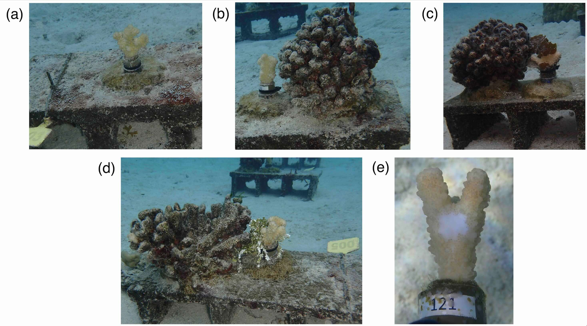

# Renzi_etal_202X_legacies
Data and analysis for Renzi et al. 202X (*Legacies of despair: how do structural and biological legacies from disturbance interact to influence coral growth and survivorship?*), which we are currently submitting for peer review.

- `data` folder contains original data from the experiment (see Data files section below for more information)
- `figures` folder stores figure outputs from code in PDF format (gitignore is set to ignore these files, but the files in `R` will output figures here if the code is run)
- `R` folder holds all annotated R code (in R-markdown format) used for analyses and figure creation (see R files section below for more information)
- `images` folder stores images not generated by this code

## Permanent data availability

Upon acceptance, all data will be permanently available on EDI and all code will be published on Zenodo. We will then update associated links here.

## Description of the data and file structure

All data are stored in the data folder and all scripts are stored in the R folder. All scripts use relative file paths and can be run in any order.

### Files and variables

###### Lead & Corresponding Author Contact Information

```
Name: Julianna Renzi
Institution: University of California, Santa Barbara
Current email: jrenzi@ucsb.edu
Permanent email: julianna.renzi@gmail.com
```

## Dataset Overview

This dataset contains the data and code required to replicate analyses in Renzi et al. (in prep). This dataset was collected as part of a 9-month long experiment in Moorea, French Polynesia examining the effects of dead coral skeletons, associated macroalgae (i.e., *Halimeda* and *Lobophora* spp.), and wounding by the corallivorous snail *Drupella* on *Pocillopora* coral fragments. We ran the experiment on a shallow (~2 m) sandflat on the North shore lagoon between July 2023 and May 2024. For the experiment, we exposed 120 *Pocillopora* coral fragments (~8 cm height) to one of two wounding treatments (an initial wound by *Drupella* or not) crossed with four structure treatments:

| Skeleton treatment        | Description           | Number of coral colonies  |
| ------------- |:-------------:| -----:|
| Control      | No skeleton or macroalgae | 15 +snail, 15 -snail (n=30) |
| Skeleton      | Proximity (~1cm) to a coral skeleton with turf algae      |   15 +snail, 15 -snail (n=30) |
| *Halimeda* skeleton | Proximity (~1cm) to a coral skeleton with turf algae **and** contact with *Halimeda* spp.      |    15 +snail, 15 -snail (n=30) |
| *Lobophora* skeleton | Proximity (~1cm) to a coral skeleton with turf algae **and** contact with *Lobophora* spp.      |    15 +snail, 15 -snail (n=30) |

For the first three months of the experiment, all corals were monitored every ~3-4 days, macroalgae were replaced regularly, and we tracked the change in coral wet weight. After 3 months we removed macroalgal treatments and monitored survivorship through the warm season for corals in proximity to a coral skeleton (formerly Skeleton, *Halimeda* skeleton, and *Lobophora* skeleton treatments) vs. controls. In late April/early May we quantified tissue loss after 6 months of skeleton exposure and ended the experiment. *Drupella* wounds were created by gently cable tying snails to coral fragments for two days, following established methods (Clements and Hay 2018, Rice et al. 2021), and snail wound size was measured using ImageJ software (Abramoff et al. 2004; Schneider et al. 2012).



**Experimental treatments:** Panel (a) shows a control *Pocillopora* coral fragment with no structure nearby. Panel (b) is a coral fragment in a skeleton treatment. Panel (c) is a coral fragment in a skeleton with *Lobophora* treatment. *Lobophora* was attached both to the base of the tube and to a nearby branch to simulate natural overgrowth patterns. Panel (d) is a coral fragment in the skeleton with *Halimeda* treatment. Panel (f) shows an example of a fresh snail wound created at the beginning of the experiment. All treatments (a-d) were fully crossed with snail wounding (n = 15/treatment)


### Recommended Citation

Official citation forthcoming

Julianna J. Renzi, Noam Altman-Kurosaki, Jaden Harding, Thomas C. Adam, Nicolas S. Jeffress, and Deron E. Burkepile (202X). Legacies of despair: how do structural and biological legacies from disturbance interact to influence coral growth and survivorship? *In prep*.

### Acknowledgements

We thank the community of Moorea for hosting this research on Tahitian land and waters. With respect to the spelling of Moorea, we followed the Raapoto transcription system, but also recognize other community members follow the Te Fare Vanā’a transcription system where the island name is spelled with an ’eta (Mo’orea). Research was completed under permits issued by the Territorial Government of French Polynesia (Délégation à la Recherche) and the Haut-Commissariat de la République en Polynésie Francaise (DTRT), and we thank the Délégation à la Recherche and DTRT for their continued support. Ellie Halewood, Craig Nelson, and Rebecca Vega Thurber provided valuable technical expertise. Adrian Stier, Joan Dudney, Greta Aeby, and Sally Holbrook provided useful feedback on the scientific questions and experimental design. We would like to thank Mark Renzi (ERA), Lauren Enright, Lindsay Cullen, Noe Castañeda, Olivia Isbell, Elliott Cameron, and Rio Kashimoto for assistance in the field as well as the entire University of California Gump Research Station staff, with whom this work would not have been possible.

### Funding

This work was funded with support from: NSF awards OCE 2023424 and OCE 2023701 granted to DEB and TCA; a Schmidt Family Foundation Mentorship Grant to JJR and JH; a U.S. National Science Foundation (NSF) Graduate Research Fellowship to JJR; a University of California Chancellor’s Fellowship to JJR; a U.S. National Science Foundation grant to Mark Hay (OCE 1947522); an ARCS Foundation Atlanta Herz Global Impact Award to NAK; a Georgia Tech President’s and Institute Fellowship to NAK; and the NSF Moorea Coral Reef Long Term Ecological research site under NSF Awards OCE 1637396 and 2224354. Additional financial support to the MCR LTER site was provided through a generous gift from the Gordon and Betty Moore Foundation.

### Citations

Abramoff MD, Magalhães PJ, Ram SJ (2004) Image processing with ImageJ. In: Biophotonics international. http://dspace.library.uu.nl/handle/1874/204900. Accessed 31 Oct 2019

Clements CS, Hay ME (2018) Overlooked coral predators suppress foundation species as reefs degrade. Ecol Appl 28:1673–1682. https://doi.org/10.1002/eap.1765

Rice MM, Baldwin DG, Fischer JN, et al (2021) Complex interactions with nutrients and sediment alter the effects of predation on a reef-building coral. Marine Ecology 42:e12670. https://doi.org/10.1111/maec.12670

Schneider CA, Rasband WS, Eliceiri KW (2012) NIH Image to ImageJ: 25 years of image analysis. Nat Methods 9:671–675. https://doi.org/10.1038/nmeth.2089

# Data files

- Note that due to storage limitations on GitHub, the timeseries data from the Moorea Coral Reef LTER are not included here, but they can be downloaded freely here: https://mcr.lternet.edu/data
- All dates are reported as YYYY-MM-DD

## File: metadata.csv

*Metadata*

**Description:** Metadata on experimental coral  

#### Variables

* coral_id: Unique identifier for each coral fragment. This ID is consistent across files. Use this to join across datasets
* row: Coral's location in experimental array; rows run approximately parallel to shore
* parent_colony: Unique identifier of the parent colony (genotype) the coral fragment came from. Every parent colony experienced every treatment
* treatment_full: Full treatment identifier, encompassing both structure (control/skeleton/hali/loboph) and snail (drupella or none) treatments
* treatment_skeleton: Structure treatment identifier with categories for the four structure treatments (control/skeleton/hali/loboph)
* treatment_drupella: Snail treatment identifier with categories for the two structure treatments (wounded = y or unwounded = n)
* exclude_date: The date a coral was observed with predation signs. NA's indicate the coral was never predated upon 
* exclude_reason: The predator responsible for coral exclusion

## File: coral_wet_weights_3mo.csv

*Experimental coral weights*

**Description:** Weights of experimental corals before treatment application and after 3 months. Corals were wet weighed in the field using an OHAUS Scout Pro electronic scale in an enclosed box mounted to a tripod balanced above the water on a coral bommie. Epoxied bases were gently scrubbed with a toothbrush to remove any fouling organisms prior to weighing.

#### Variables

* coral_id: Unique identifier for each coral fragment. This ID is consistent across files. Use this to join across datasets
* date: Date coral was weighed
* time_point: Category for the date of weighing--0 = before treatments were applied, 1 = at the end of 3 months
* wet_weight_g: Weight of corals in grams

## File: tissue_cover.csv

*Coral tissue cover*

**Description:** Coral tissue cover over the course of the experiment (3 months, 3.5 months, and 9 months) 

#### Variables

* coral_id: Unique identifier for each coral fragment. This ID is consistent across files. Use this to join across datasets
* tissue_cover_3mo: Percent of coral fragment covered in tissue on October 28. 100 = 100% tissue cover (i.e., 0% tissue loss since the start of the experiment)
* tissue_cover_postmicrobe: Percent of coral fragment covered in tissue on November 14, after corals were sampled for their microbiomes. 100 = 100% tissue cover (i.e., 0% tissue loss since the start of the experiment)
* tissue_cover_9mo: Percent of coral fragment covered in tissue on April 29-May 1, during the last timepoint of the experiment. 100 = 100% tissue cover (i.e., 0% tissue loss since the start of the experiment)
* notes: Notes were added to explain why three corals were removed from Nov-May analysis

## File: wound_healing.csv

*Rates of snail wound healing*

**Description:** Binary determination of whether snail wounds were healed or not across photographic time points.

#### Variables

* coral_id: Unique identifier for each coral fragment. This ID is consistent across files. Use this to join across datasets
* censored: Categorical marker representing whether a coral healed from the wound during the time period (i.e., censored = 1) or whether the coral did not heal before either: (1) the end of the experiment or (2) the coral was predated on by rogue *Drupella* or *Culcita* and removed from subsequent analyses (i.e., censored = 0)
* exclude_date: The date a coral was observed with predation signs. NA's indicate the coral was never predated upon 
* exclude_reason: The predator responsible for coral exclusion
* observe_date: The date the photographs were taken that were used to determine if the wound had healed
* wound_healed: Binary marker noting whether the wound was fully healed (wound_healed = 1) or not (wound_healed = 0) on observe_date

## File: wound_sizes.csv

*Snail would sizes*

**Description:** Snail would sizes on experimental corals. Wounds were measured in ImageJ using reference lengths. 

#### Variables

* coral_id: Unique identifier for each coral fragment. This ID is consistent across files. Use this to join across datasets
* size_mm2: Measured length of snail wound in mm^2 

## File: snail_lengths.csv

*Lengths of experimental Drupella*

**Description:** Lengths (i.e. tip of the shell apex to the edge of the bottom lip) of experimental *Drupella* used for snail treatments. 

#### Variables

* coral_id: Unique identifier of coral fragment. This ID is consistent across files. Use this to join across datasets
* snail_length_mm: Length of snail shells in mm 

# R files

## File: analysis_initial_differences.Rmd

**Description:** Rmd file that calculates the general statistics used in the methods to note final sample sizes, average snail sizes, average wound sizes, and that there were no significant differences among treatments for snail or wound size.

## File: timeseries_mcr.Rmd

**Description:** Rmd file uses the Moorea Coral Reef Long Term Ecological Research time series to generate **Fig. 1a**

## File: analysis_weight.Rmd

**Description:** Rmd file that analyzes changes in coral weights over 3 months and produces **Fig. 2** 

## File: analysis_tissue_cover_3mo.Rmd

**Description:** Rmd file that analyzes changes in coral tissue cover over 3 months (July-November) and produces **Fig. S3**

## File: analysis_tissue_cover_9mo.Rmd

**Description:** Rmd file that analyzes changes in coral tissue cover over 6 months (November-May) and produces **Fig. 4**

## File: analysis_wound_healing.Rmd

**Description:** Rmd file that analyzes rates of wound healing and produces **Fig. 3**

